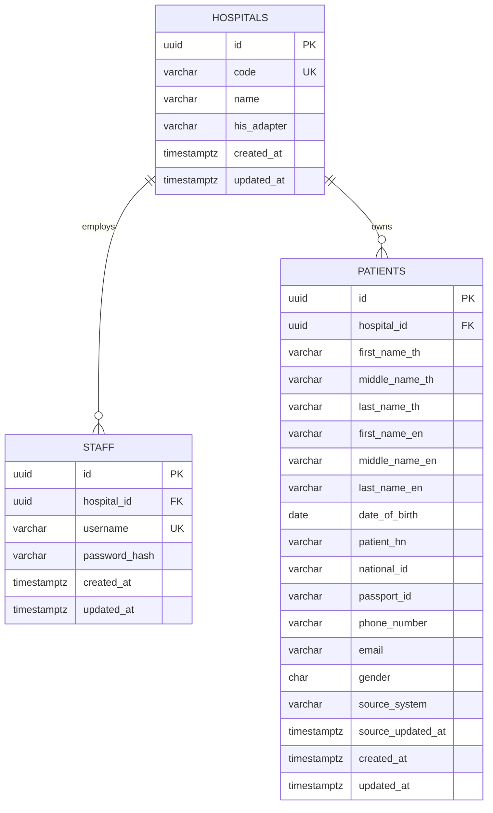

# Entity-Relationship Diagram

## Constraints and tenant rules

- `hospitals.code` is the stable external/API identifier.
- `staff.username` is globally unique because login has no hospital input.
- Each staff member and patient has exactly one `hospital_id`.
- Patient access is always filtered by the `hospital_id` in the authenticated staff token.
- `(hospital_id, patient_hn)` is unique.
- `(hospital_id, national_id)` and `(hospital_id, passport_id)` are unique when the identifier is present.
- A patient must have at least one of `national_id` or `passport_id`.
- `gender` is constrained to `M` or `F` to match the stated Hospital A contract.

## Data flow

An identifier lookup goes to the hospital adapter. The normalized response is upserted using the hospital and HN identity, then queried again with every client-supplied filter. A non-identifier search queries previously normalized patient rows and is still limited to the authenticated hospital.

